# twn_election — 台湾 2026 九合一地方選挙 3D マップ

[繁體中文](README.md) · [English](README.en.md) · [日本語](README.ja.md)

C++20、Bazel（bzlmod のみ）、Vulkan、Skia で開発した台湾のインタラクティブ 3D マップと選挙ダッシュボードです。2026年11月28日の九合一地方選挙を表示します。UI は繁体字中国語（既定）、日本語、英語に対応しています。

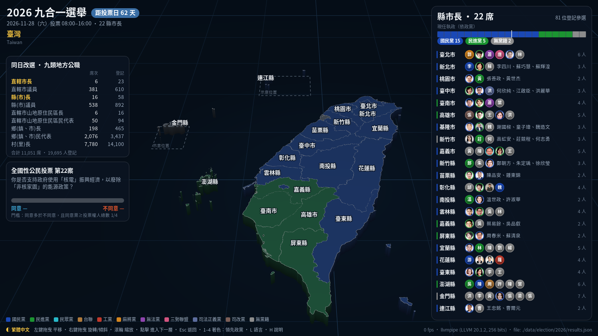

| | |
|---|---|
| 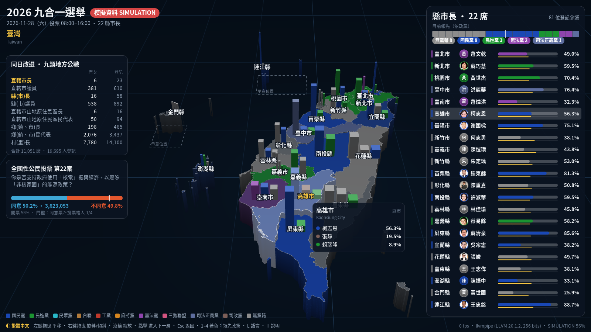 | 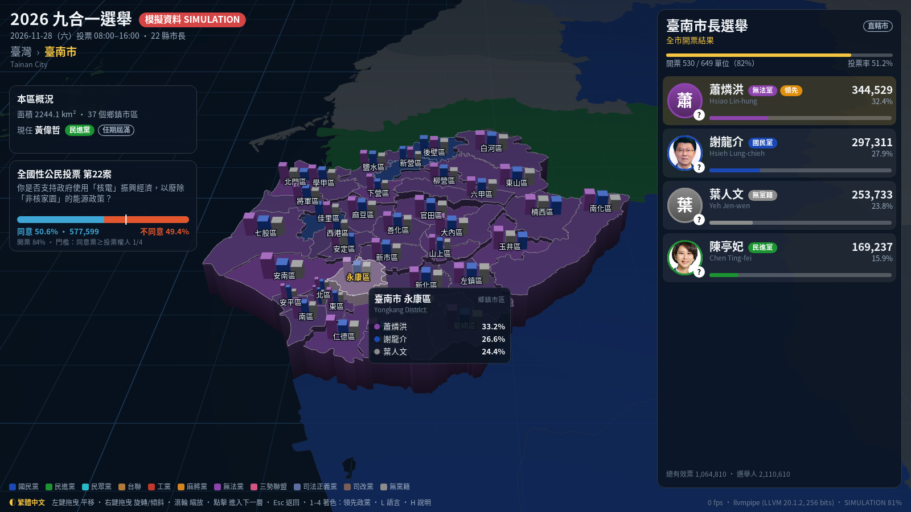 |
| 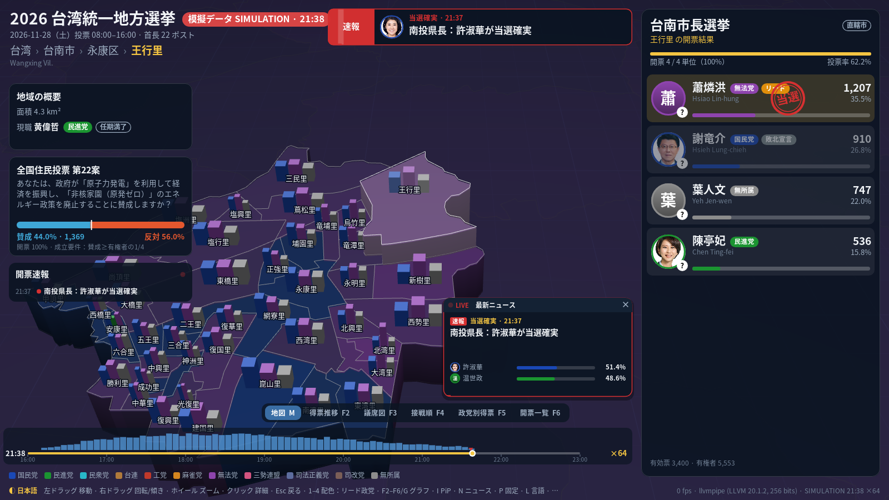 | 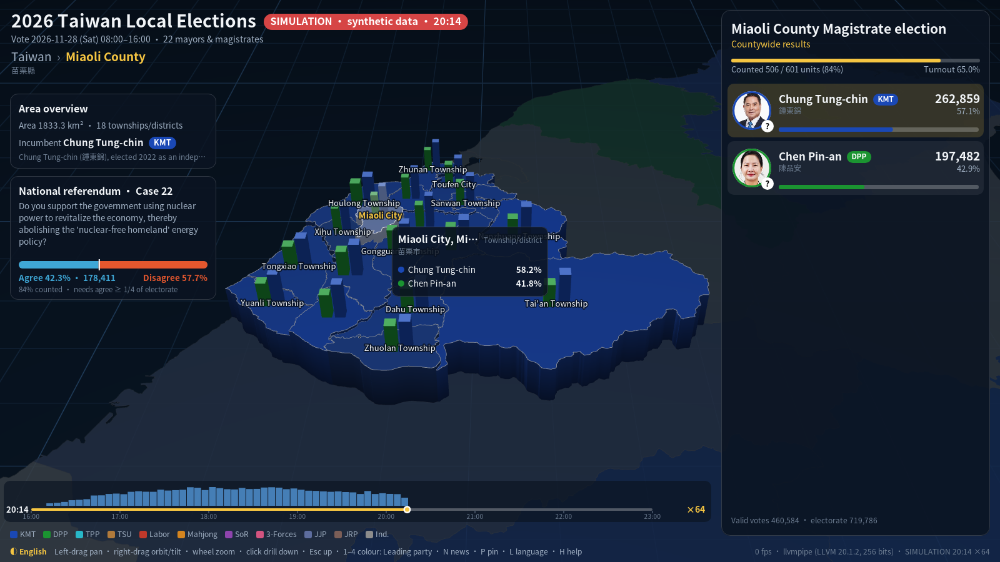 |

### 選挙当夜（シミュレーション）

| | |
|---|---|
| 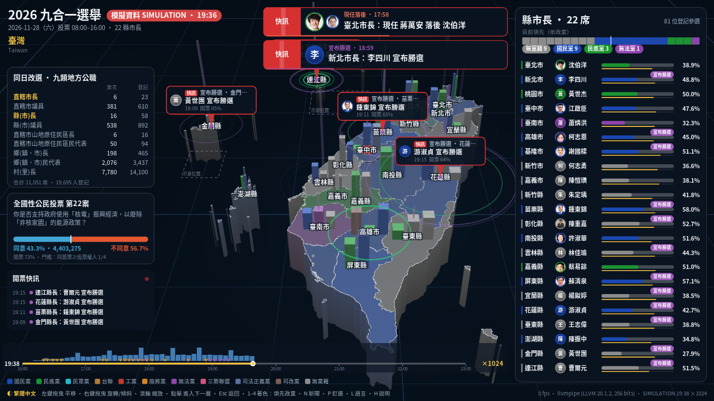 | 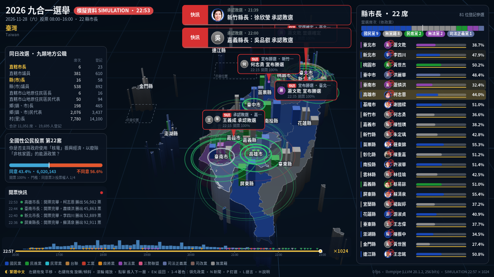 |
| 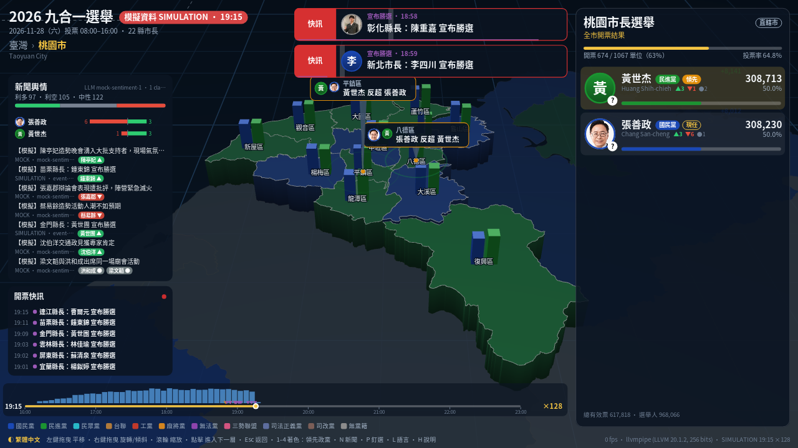 | 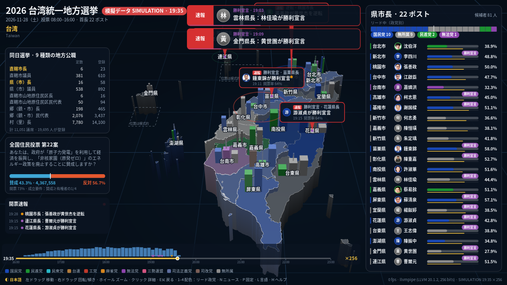 |

### グラフ

| | |
|---|---|
| 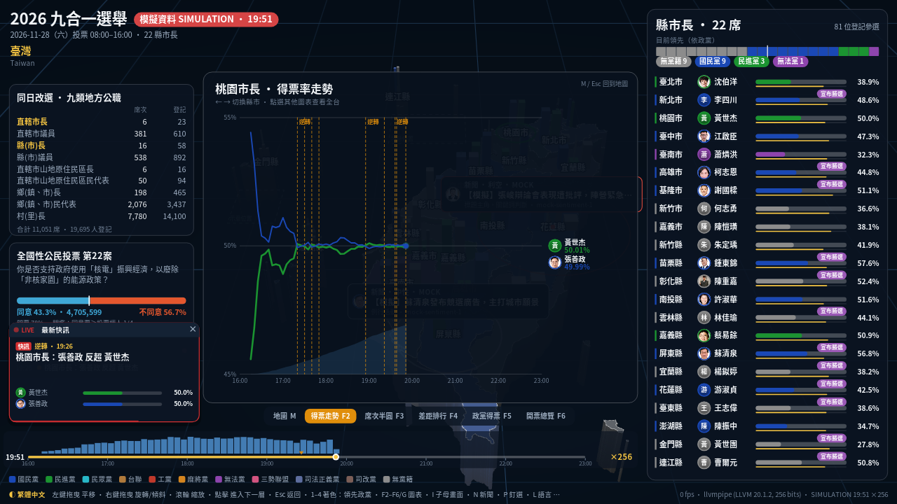 | 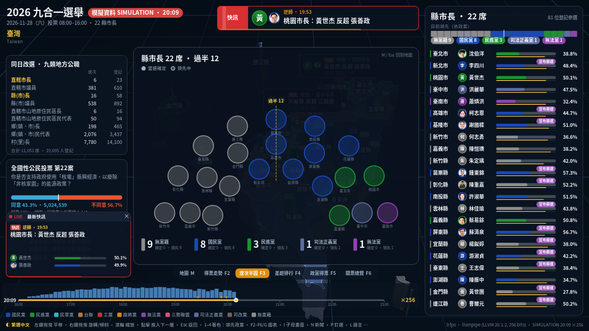 |
| 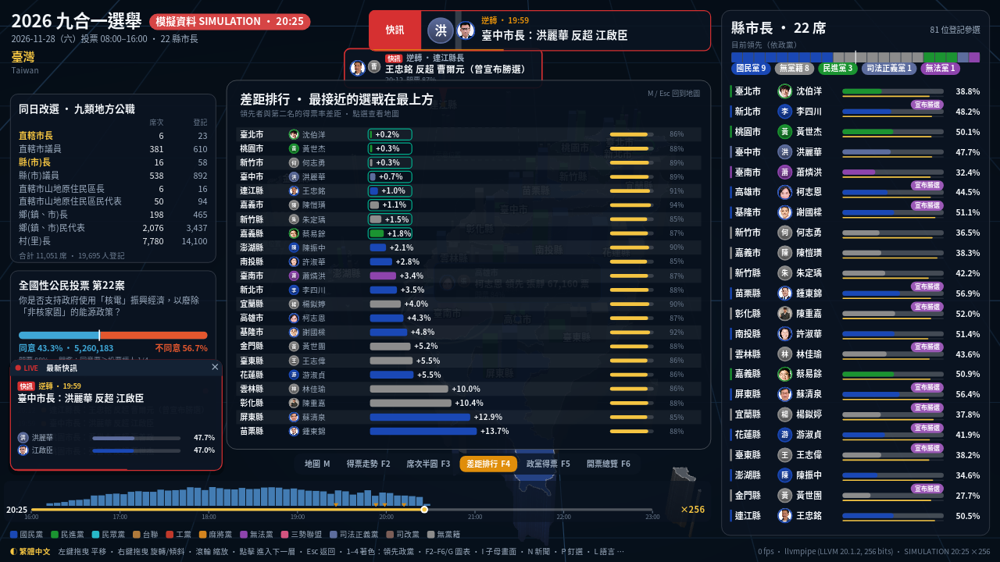 | 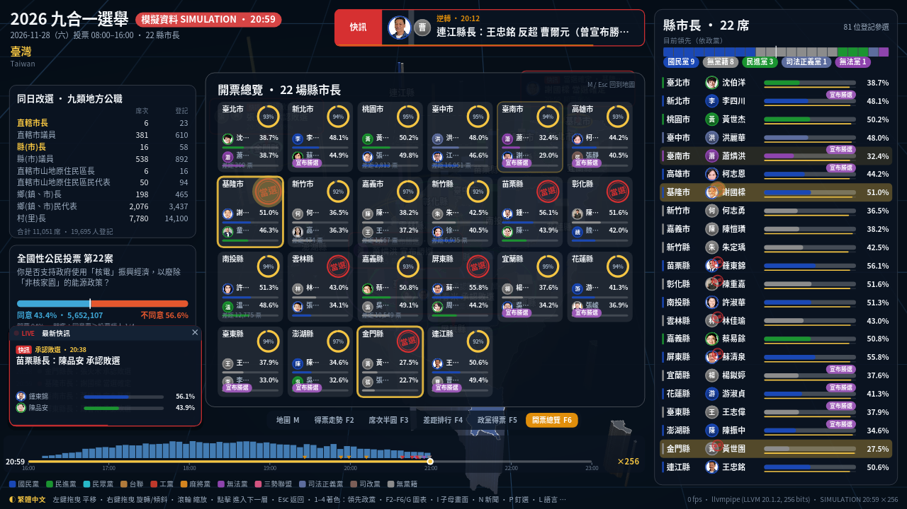 |

[docs/demo/](docs/demo/) に、ヘッドレスモードで出力した 1280×720 のデモ動画があります。

| 動画 | 内容 |
|---|---|
| [election_night_demo.mp4](docs/demo/election_night_demo.mp4) | 下記の動画を連結した約82秒の動画 |
| [01_whole_night_x1024.mp4](docs/demo/01_whole_night_x1024.mp4) | 16:00〜23:00 の全体を ×1024 で再生 |
| [02_close_race_news_x128.mp4](docs/demo/02_close_race_news_x128.mp4) | 桃園の接戦とモック LLM によるニュース分類 |
| [03_japanese_ui.mp4](docs/demo/03_japanese_ui.mp4) | 日本語 UI |
| [04_charts_and_pip_tour.mp4](docs/demo/04_charts_and_pip_tour.mp4) | 地図、5種類のグラフ、PiP のツアー |

`--record=DIR --record_seconds=S --fps=F` で再録画できます。グラフツアーには `--chart_tour=4` を追加し、ffmpeg で動画にします。

> 色付きの開票画面は `--simulate` の合成データです。ランダムに生成される値は実際の結果や予測ではありません。画面には常に「模擬資料 SIMULATION」と表示されます。選挙日前はカウントダウン、現職者、届出済み候補者など実際の選挙前情報を表示します。

## 主な機能

- **台湾の 3D 地図：**Vulkan で県市、郷鎮市区、村里を立体表示します。4× MSAA、フォグ、海面グリッドを備え、金門・馬祖は独立したインセットで表示します。
- **地図操作：**ドラッグで移動、ホイールでズーム、回転・傾き、アニメーション付きの移動に対応します。台湾全土から 22 県市、368 郷鎮市区、約7,700村里へ順に掘り下げられます。Esc、Backspace、右クリックで上の階層に戻ります。隣接地域をクリックすると直接移動します。
- **Skia ダッシュボード：**選挙までのカウントダウン、開票状況、政党別議席、22首長選挙の候補者81人、各地域の得票と開票率を表示します。候補者カードには写真、政党、推薦・支持、現職／任期満了タグがあります。同じ投票用紙の9職種と、同日に行われる全国住民投票第22案（原子力）も表示します。
- **政党別の地図色：**開票前は現職者の政党、開票中はリード候補者の政党で地域を色分けし、明るさで得票差を示します。各地域の上位3人を3Dバーで表示します。開票率、投票率、住民投票の賛成／反対でも色分けできます。
- **最新データ：**results JSON ファイルを監視し、変更時に再読込します。データの地域階層が一部欠けていても、村里から郷鎮市区、県市へ集計します。
- **選挙当夜シミュレーション：**16:00 の投票終了後、約16,000か所の模擬投開票所がランダムな順番で票を報告し、23:00頃に完了します。リード交代、勝利宣言、敗北宣言、当選予測、最終結果を再現します。速度は ×1 から ×4096 まで設定できます。
- **更新アニメーション：**票数の増加、地域の発光、候補者カードの並べ替え、地図色のクロスフェード、リード交代の波紋、速報バナー、当選スタンプ、開票タイムラインを表示します。
- **ニュースの情勢分析：**RSS／Atom と JSONL を取り込み、OpenAI 互換 LLM またはオフラインのキーワード判定で分類します。候補者ごとの好材料・悪材料を数え、SQLite に保存します。モックニュースとモック LLM サーバーで一連の機能を試せます。
- **ホーム地域：**`P` を押すと現在の地域を次回起動時のホームに設定します。
- **ヘッドレスモード：**ディスプレイや GPU のない環境で PNG を出力できます。CI では Mesa lavapipe を使用できます。

## データ

| 内容 | 場所 | 出典 |
|---|---|---|
| 首長候補者81人、政党、現職者 | `data/election/2026/candidates.json`（[候補者一覧](docs/CANDIDATES.md)） | 中央選挙委員会の届出資料（2026-08-31〜09-04）。中央社、自由時報、聯合報、華視、Yahoo などの報道も参照。リンクは `election.json` |
| 政党名（中・日・英）と色 | `data/election/2026/parties.json` | — |
| 選挙職種、住民投票第22案 | `data/election/2026/election.json` | 選管公開資料・報道 |
| 県市、郷鎮市区、村里の地図 | `data/map/villages-10t.json` | [taiwan-atlas](https://github.com/dkaoster/taiwan-atlas)（MIT）。内政部の境界データを加工 |
| 候補者写真（81人中33人） | `assets/photos/<id>.jpg` | 主に立法院・議会の公式写真。出典は `assets/photos/CREDITS.json` |
| 開票結果 | `data/election/2026/results.json` | 選挙前のプレースホルダー。票数は未入力 |

注意事項：

- 登録済み候補者を掲載しています。中央選挙委員会は10月16日に資格審査を終え、10月23日に投票番号を抽選する予定です。それまでは `ballot_no` が `null` です。番号確定後 JSON を更新すると、番号順にカードを並べます。
- 一部の英語ローマ字表記は暫定です（`romanization_guess: true`）。
- 写真がない候補者には、姓と政党色を使ったアバターを表示します。ネット接続できる環境では `tools/fetch_photos.py` で Wikimedia Commons の自由ライセンス写真を探せます。
- Wikimedia Commons の写真5枚は作者情報が未記録です。公開前に確認して `CREDITS.json` に記載してください。
- 詳細データは22首長選挙が対象です。同じ投票用紙のその他11,029議席（議員、郷鎮長、村里長など）は集計数で表示します。

## ビルドと実行

Ubuntu／Debian で必要なパッケージ：

```sh
sudo apt install build-essential libvulkan1 mesa-vulkan-drivers libglfw3-dev \
                 libcurl4-openssl-dev libasound2-dev glslang-tools fonts-noto-cjk git
# Bazelisk をインストール。.bazelversion は Bazel 8.3.1 を指定
```

macOS は `brew install glfw glslang molten-vk` と CJK フォントディレクトリ（`--font_dir`）で動作する想定ですが、Linux のみテストしています。

```sh
bazel run //:twn_election                          # ウィンドウ、既定は繁体字中国語
bazel run //:twn_election -- --lang=ja             # 日本語
bazel run //:twn_election -- --lang=en             # English
bazel run //:twn_election -- --simulate            # 開票シミュレーション（合成データ）
bazel run //:twn_election -- --simulate --sim_speed=256 --sim_clock=18:30
bazel run //:twn_election -- --simulate --news     # モックニュースと感情分類
bazel run //:twn_election -- --focus=63000         # 台北市にズームして起動
bazel run //:twn_election -- --results=/path/live.json

# ヘッドレス（lavapipe を使用可能）
bazel run //:twn_election -- --headless --screenshot=$PWD/out.png --focus=67000 --lang=en
bazel test //tests/...
```

初回ビルドでは固定バージョンの Skia を取得し、約600個のソースをコンパイルするため数分かかります。2回目以降は差分のみビルドします。`--help` で全フラグを確認できます。地域コードは内政部の地図コードです。例：県市 `63000`、郷鎮市区 `63000030`、村里 `63000030001`。

### キー操作

| キー | 操作 |
|---|---|
| 左ドラッグ | 地図を移動 |
| 右／中ドラッグ | 回転／傾き |
| ホイール、`+`／`-` | カーソル位置を中心にズーム |
| クリック | 地域を掘り下げる |
| Esc／Backspace／右クリック | 1階層戻る |
| 矢印／WASD、Q／E、R／F | 移動、回転、傾き |
| `1` `2` `3` `4` | リード政党、開票率、投票率、住民投票で色分け |
| `L` | 繁体字中国語、日本語、英語を切替 |
| `Space` | シミュレーションの一時停止／再開 |
| `,`／Page Down；`.`／Page Up | シミュレーション速度を半分／2倍 |
| `[` `]` | シミュレーション時間を30分戻す／進める |
| `F7` | 16:00 からシミュレーションを再スタート |
| `F2`〜`F6` | 得票推移、議席、得票差、政党別得票、選挙区一覧のグラフ |
| `G`／`M` | 表示を順送り／地図に戻る |
| `I` | 最新ニュースの PiP を表示／非表示 |
| `←` `→` | 得票推移グラフの選挙区を切替 |
| `N` | ニュース感情パネル |
| `V` | BGM のオン／オフ |
| `P` | 現在の地域をホームに設定／解除 |
| `Home` | ホーム地域または台湾全土へ移動。`H` で操作説明 |

## 選挙当夜シミュレーション

`--simulate` は開票の流れを再現します。投票は16:00に締め切られ、16:15頃から速報が入り始めます。17:00〜20:00に多くの票が報告され、最後の票は23:00頃に届きます。約16,000か所の合成投開票所から村里単位で票が加算されます。早期と後期の投票所で候補者の傾向に差があるため、リードが入れ替わる選挙区もあります。候補者の強さは政党を考慮せずランダムに決めており、予測ではありません。

速度は ×1（実時間で7時間）から ×4096、既定値は ×64（全体で約6分半）です。`.`／Page Up で加速、`,`／Page Down で減速、`Space` で一時停止、`F7` で16:00から再スタートできます。再スタート時は合成票、イベント、グラフ履歴もリセットします。

既定では144 BPMのアップテンポな BGM が再生されます。ドラム、シンコペーションのベース、重ねたメロディーを含みます。`V` で切り替えるか、`--no_music` で無効にできます。

```sh
bazel run //tools:results_tool -- --night  # イベント全体のタイムライン
```

### イベントと速報

| イベント | 内容 | 速報 |
|---|---|---|
| リード交代 | 新候補が0.1%以上、かつ最低30票差でリード | はい |
| 勝利宣言 | 選挙陣営による宣言。開票完了や選管発表より前に行われる | はい |
| 敗北宣言 | 次点候補が数分後に敗北を認める | はい |
| 当選予測 | リードが未開票票の推定数を上回る（開票率25%以上） | はい |
| 現職が劣勢 | 開票率30%以上で現職候補がリードを許す | はい |
| 初回速報 | その選挙区の最初の票が到着 | いいえ |
| 接戦 | 開票率70%以上で差が1%未満 | いいえ |
| 開票完了 | 全ての計票単位の集計が完了。正式発表は数日後 | いいえ |

### アニメーション

| 更新 | 表示 |
|---|---|
| 新しい票 | 数字のカウントアップ、カードの追加票、地域の発光、得票流入グラフ |
| 地域のリード交代 | 新政党色の波紋、地図色のフェード、逆転コールアウト |
| 継続的な開票 | 約2.5秒ごとに、最も開票が進んだ地域のリードと進捗を表示 |
| 選挙区のリード交代 | BREAKING バナー、候補者写真、カードの並べ替えと金色の光 |
| 勝利／敗北宣言 | バナー、地図コールアウト、候補者カードの状態タグ |
| 当選予測 | カードに「当選」印、地図に金色の波紋とマーカー |
| ニュース分類 | 候補者の好材料・悪材料の件数、地域の波紋 |
| タイムライン | 16:00〜23:00 の再生位置、5分ごとの得票数、イベントマーカー |

## グラフとピクチャーインピクチャー

地図がメイン画面です。ショートカットまたは地図下部のタブから5種類のグラフを開けます。`M`、Esc、地図タブで地図に戻り、`G` でビューを順に切り替えます。グラフ表示中も背景の地図はアニメーションします。

| キー | グラフ | 内容 |
|---|---|---|
| F2 | 得票推移 | 16:00〜23:00の得票率、リード交代、当選予測、開票率。`←`／`→` で選挙区を切替 |
| F3 | 議席半円 | 22議席を政党別に表示。予測／リード議席と過半数ライン（12） |
| F4 | 得票差 | リード候補と次点の得票差順に並べ、開票率と当選予測を表示 |
| F5 | 政党別得票 | 22選挙区の政党別全国得票、得票率、獲得／リード議席 |
| F6 | 選挙区一覧 | 22選挙区の開票率、上位2候補の得票率、宣言／予測状況 |

得票差、一覧、議席の項目をクリックすると、その県市の地図に戻ります。得票推移グラフでは選挙区を切り替えます。

**PiP（最新ニュース）：**速報、選挙区のミニ票数グラフ、候補者別ニュース感情を表示します。6.5秒ごとに内容が切り替わり、新しい速報は優先表示されます。地図では右下、グラフでは左下に表示します。`I` で切替、×で閉じ、クリックでその選挙区を地図に表示します。

## ニュース感情分析（LLM）

`--news` はバックグラウンド処理を起動します。`data/news/feeds.json` の RSS／Atom feed と `data/news/inbox/` の JSONL ファイルを読み、記事を SQLite に保存します。各記事について関連候補、候補者ごとの好材料／悪材料／中立、短い要約を分類します。候補者カードに件数を表示し、`N` でニュース一覧と分布を開きます。

OpenAI 互換の Chat Completions API を利用し、`{base_url}/chat/completions` に JSON を送信します。OpenAI、Azure OpenAI、OpenRouter、Ollama、vLLM、LM Studio、llama.cpp server に対応します。

```sh
export OPENAI_API_KEY=sk-...                       # または TWN_LLM_API_KEY
bazel run //:twn_election -- --news --llm_model=gpt-4o-mini
bazel run //:twn_election -- --news --llm_base_url=http://localhost:11434/v1 --llm_model=qwen2.5
bazel run //:twn_election -- --news --no_llm       # オフラインのキーワード判定のみ
```

API キー／ローカル端点がない場合や呼び出しに失敗した場合は、キーワード判定（`model = "heuristic"`）にフォールバックします。選挙イベントも固定ルールでニュース化します。例えばリード交代は新リード候補に好材料、追い越された候補に悪材料となります（`model = "event-rule"`）。

**モックニュース：**`--simulate --news` または `--mock_news` で、LLM・画面・アニメーション確認用の合成ニュースを生成します。各記事には「【模擬】」、`MOCK` ソース、`mock://` URL が付き、実際の報道ではないことを明記します。内容は集会、推薦、世論調査の変化、対立候補への批判などに限定し、実在人物の犯罪やスキャンダルを作りません。正解ラベル付きなので `news_tool --eval=N` で分類精度を測れます。`tools/mock_openai_server.py` を使うと API キーなしで LLM 経路を試せます。

```sh
python3 tools/mock_openai_server.py --port 8089 &
bazel run //:twn_election -- --simulate --news --llm_base_url=http://127.0.0.1:8089/v1 --llm_model=mock
bazel run //tools:news_tool -- --eval=200 --llm_model=gpt-4o-mini
bazel run //tools:news_tool -- --stats
bazel run //tools:news_tool -- --fetch | --ingest=f.jsonl | --latest=10 | --mock=50 --rss=mock.xml
```

## SQLite データベース

既定の `twn_election.db` はプロジェクトのルートに作られます。`--db` で変更できます。WAL モードを使用するため、ニュース処理が書き込み中でも UI は読み取りを続けられます。

| テーブル | 内容 |
|---|---|
| `settings` | `home_region` などの設定 |
| `race_totals` | 時刻ごとの選挙区・候補者別得票数と開票単位数 |
| `events` | 選挙イベント（種類、選挙区、リード候補、差、進捗） |
| `articles` | URL を一意キーにした記事、要約、分類モデル |
| `assessments` | 候補者ごとの情勢評価（-1／0／+1）と理由 |

シミュレーションのデータにはフラグが付き、シミュレーションの再起動時に削除されます。

## 開票結果フィード

結果ファイルを1秒ごとに確認し、更新時刻が変わると再読込します。書き込み側は一時ファイルへ書いてから rename し、原子的に置き換えてください。形式は `twn_election.results/v1` です。

```json
{
  "schema": "twn_election.results/v1",
  "status": "counting",
  "source": "CEC live feed", "updated_at": "2026-11-28T17:05:00+08:00",
  "races": {
    "63000-mayor": { "regions": {
      "63000030":    { "votes": {"63000-02": 12345, "63000-05": 23456},
                       "eligible": 250000, "ballots_cast": 160000,
                       "units_counted": 120, "units_total": 180 },
      "63000010001": { "votes": {"63000-02": 321, "63000-05": 456},
                       "units_counted": 1, "units_total": 1 }
    } }
  },
  "referendums": { "ref-22": { "regions": { "TW": { "agree": 0, "disagree": 0, "eligible": 0 } } } },
  "declarations": [ { "race": "63000-mayor", "candidate": "63000-05", "type": "victory",
                      "time": "2026-11-28T19:40:00+08:00" } ]
}
```

地域コードは `TW`、県市、郷鎮市区、村里を利用できます。候補者 ID は[候補者一覧](docs/CANDIDATES.md)を参照してください。

```sh
bazel run //tools:results_tool -- --template > feed.json       # 全選挙区の空テンプレート
bazel run //tools:results_tool -- --simulate=0.5 > sim.json    # 村里単位の合成結果
bazel run //tools:results_tool -- --check=feed.json            # 検証し、県市別得票を表示
```

## アーキテクチャ

```text
MODULE.bazel            bzlmod 依存：rules_cc、Vulkan headers、glm、nlohmann_json、earcut、stb、
                        freetype、sqlite3、googletest（BCR）。Skia は固定 Git commit と BUILD overlay を使用。
                        module extension がシステム GLFW、libcurl、GLSL コンパイラーを検出
bazel/                  shader_tools.bzl、shaders.bzl、system_libs.bzl
third_party/skia/       Skia の BUILD overlay と生成されたソース一覧
src/geo/                TopoJSON、地図投影、地域階層、選択判定、押し出しメッシュ
src/election/           選挙モデル、結果解析・集計、ファイル監視、シミュレーター、イベント追跡
src/news/               RSS／Atom／JSONL、libcurl、LLM とキーワード分類、モックニュース
src/store/              SQLite 設定、結果履歴、イベント、ニュース、評価
src/render/             Vulkan ローダー、デバイス／swapchain／オフスクリーン描画、シェーダー
src/ui/                 Skia ダッシュボード、速報、タイムライン、グラフ、i18n、フォント、アバター
src/app/                カメラ、操作・アニメーション、音楽、マップ効果、シミュレーション、本体
 tests/                  地図、選挙、シミュレーション、ニュース、カメラ、i18n、Skia のテスト
 tools/                  results_tool、news_tool、mock_openai_server.py、fetch_photos.py など
```

地図メッシュは頂点ごとの地域スロットを使って一度だけ構築し、高さ・色・ハイライトを毎フレームのストレージバッファーで更新します。Skia は CPU 上でダッシュボードを描画し、そのテクスチャを Vulkan の地図に合成します。Vulkan は実行時にロードするため、ビルドにはヘッダーのみ必要です。Skia は BCR にないため、`MODULE.bazel` が固定 Git commit を取得し、`third_party/skia/skia.BUILD` でビルドします。バージョンを変更した場合は `tools/gen_skia_srcs.py /path/to/skia > third_party/skia/skia_srcs.bzl` でソース一覧を再生成してください。registry mirror や `--override_module` などのマシン固有設定は、追跡対象外の `user.bazelrc` に記述できます。

## ライセンス

コードは MIT ライセンスです（`LICENSE`、`NOTICE`）。地図データは taiwan-atlas（MIT）と政府オープンデータに基づきます。候補者写真は公的機関の写真または Wikimedia Commons の画像です。出典とクレジットは `assets/photos/CREDITS.json` に記載しています。選挙情報は中央選挙委員会の発表と報道をもとに整理しています。
